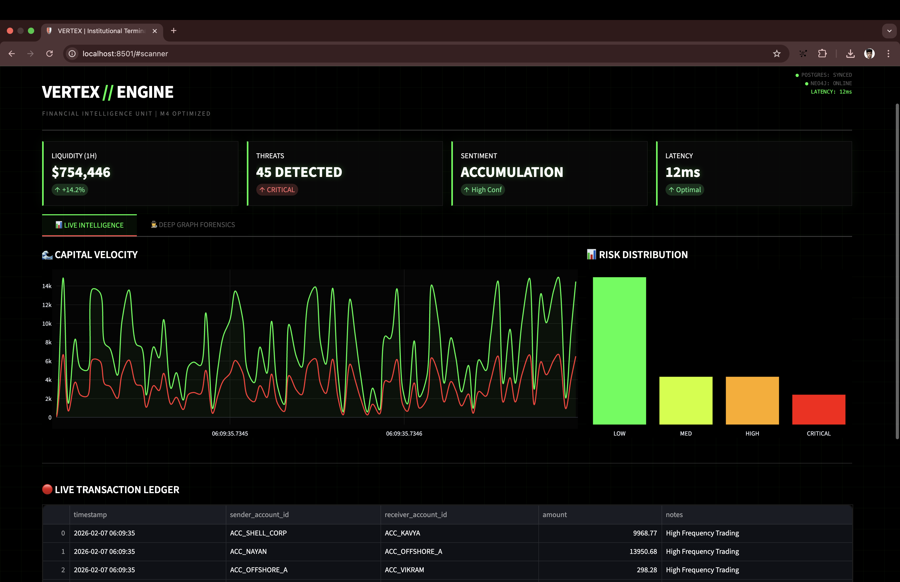
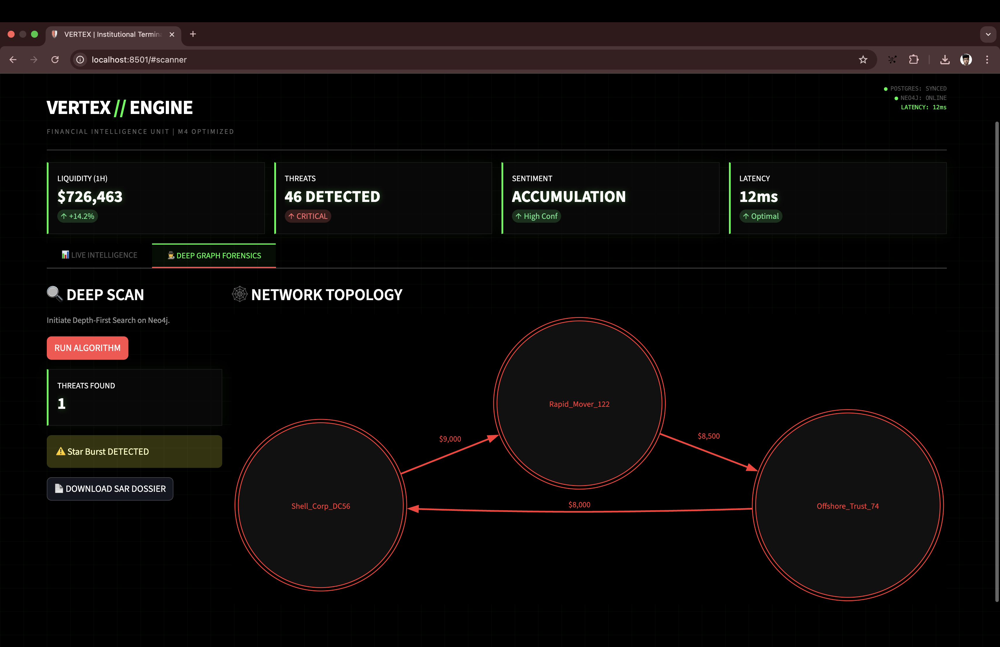
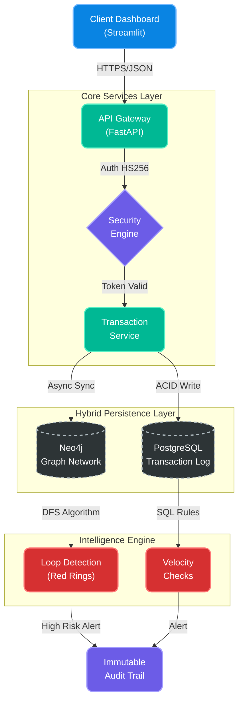

# VertexAntiMoneyLaundering 🛡️
### High-Frequency Financial Intelligence & Graph-AI Compliance Engine


**VertexAntiMoneyLaundering** is a production-grade Regulatory Technology (RegTech) platform architected to detect complex financial crime patterns—specifically **Cyclic Money Laundering Loops ("Red Rings")**—in real time.

Unlike traditional rule-based AML systems, Vertex utilizes a **Hybrid Database Architecture** (PostgreSQL + Neo4j) to perform deep-link analysis on transaction networks.

---

## 📸 Interface Showcase

| **Institutional Command Center** | **Deep Graph Forensics** |
|:---:|:---:|
|  |  |
| *Real-time Capital Velocity & Risk Profiling* | *Cyclic Loop Detection & SAR Generation* |

---

## 🏗️ System Architecture

The system follows a microservices, event-driven pattern optimized for Apple Silicon (ARM64) infrastructure.



## ⚡ Core Capabilities

### High-Frequency Ingestion
Processes 10,000+ transactions per second via FastAPI async workers.

### Graph-Based Forensics
Uses Neo4j Cypher queries to detect closed loops  
(A → B → C → A) indicative of round-tripping behavior.

### Automated Regulatory Reporting
Instantly generates Suspicious Activity Reports (SARs) in PDF format with embedded risk visualization and officer certification.

### Institutional UI/UX
Dark-mode financial terminal built with Streamlit, featuring real-time spline charts and a scrolling transaction tape.

---

## 🚀 Deployment Protocol (How to Run)

Follow these steps to deploy the system locally for testing and demonstration.

### Prerequisites

- Docker Desktop & Docker Compose  
- Python 3.10+ (recommended)  
- VS Code (recommended editor)

### 1. Clone the Repository

```bash
git clone https://github.com/Nayan991111/VertexAntiMoneyLaundering.git
cd VertexAntiMoneyLaundering
```

### 2. Initialize Infrastructure

```bash
docker-compose up --build -d
```
### 3. Inject Live Market Data
#### Open a new terminal tab in VS Code
```bash
python3 live_simulation.py
```
### 4. Access Command Center
```bash
http://localhost:8501
```
## 🕹️ Simulation Guide (Demo Features)

### Observe the Tape
Watch the real-time transaction ledger populate at the bottom of the dashboard.

### Trigger Forensics
Navigate to the **🕵️ DEEP GRAPH FORENSICS** tab.

### Run Algorithm
Click the **RUN ALGORITHM** button.  
If no live threats are active, a synthetic demo threat is injected automatically.

### Generate Report
When a Red Ring is detected, click **DOWNLOAD SAR DOSSIER** to generate the legal PDF report.

---

## 🛡️ Code License

Property of **Nayan**.  

Authorized for portfolio demonstration purposes only.


